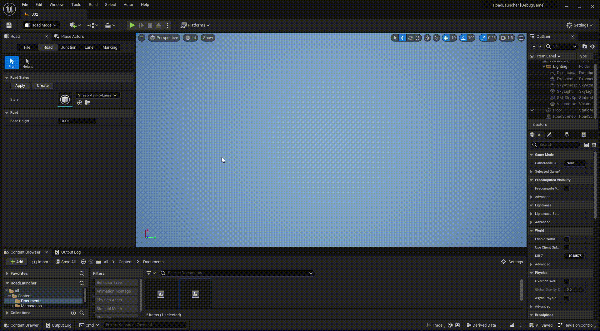
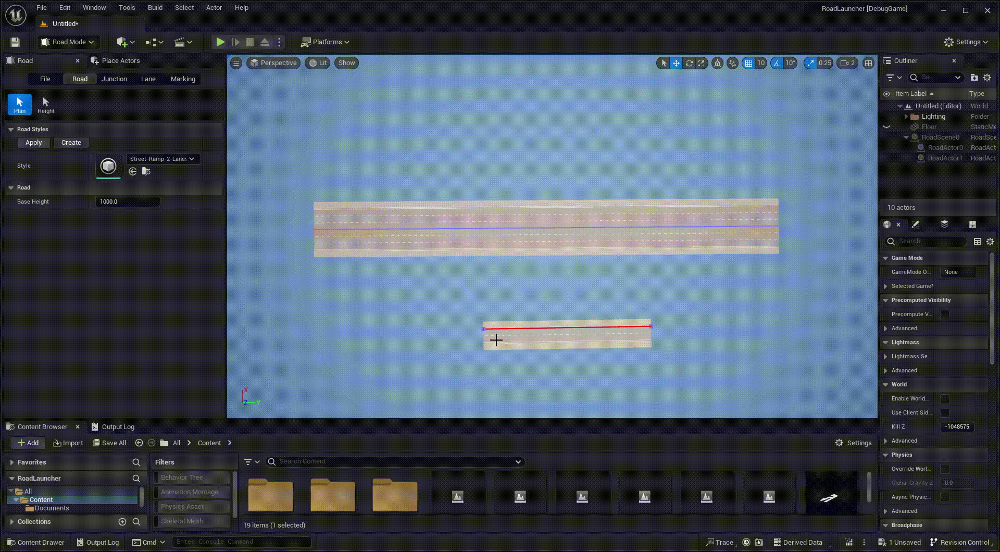

# Junction
---

## Creating junctions
 

A junction can be created automatically by the intersection of multiple roads.
 
 

A junction can also be created by gathered end-points of different roads.

## Ramp
 

A ramp junction can be created by dragging a ramp road to a proper lane of the primary road.