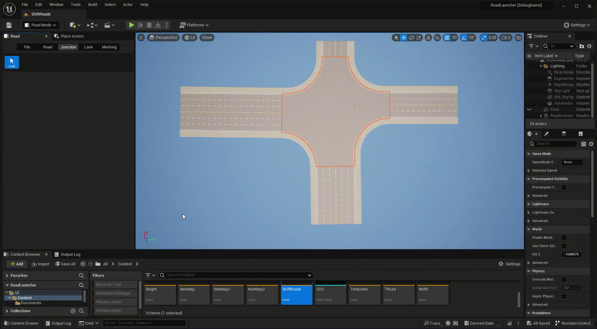
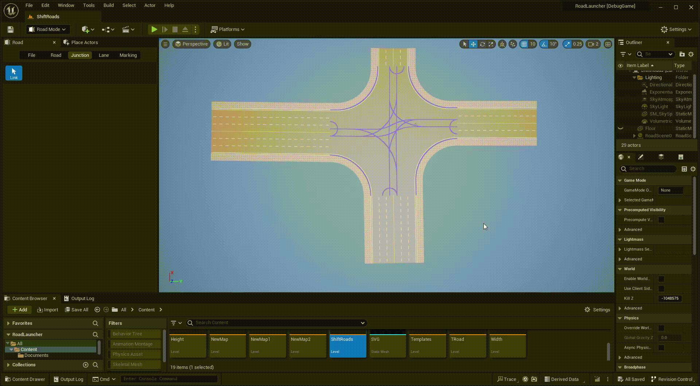

# Link
 
Links are sub-roads generated by the junction. Each roads forming the junction are connected by links in different directions.

---

Click **Junction** tab and **Link** button to activate junction link mode.
 
 

Left click any junction to display all included links.
 
 

Left click any link to select it, you can adjust the curvature radius of each links.