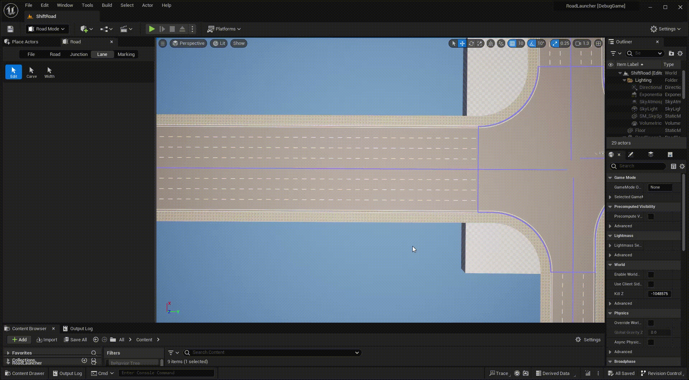

# Lane Carve
---

- Click **Lane** tab and **Carve** button to activate lane carve mode.

- Left click any road or junction to display all included lane boundaries.

- Right click each boundaries of a specific lane to carve it.

- Set proper lane type of carved segment.
