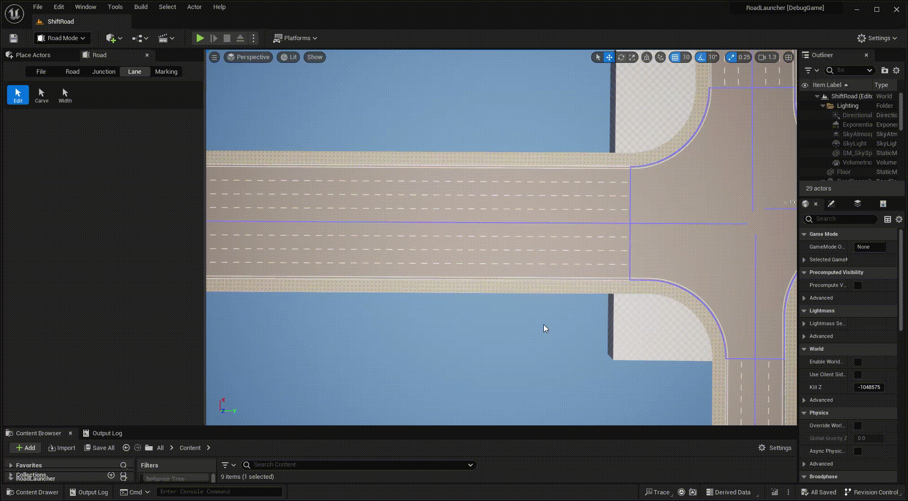
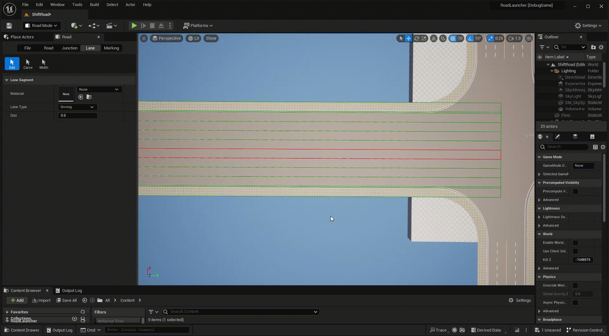
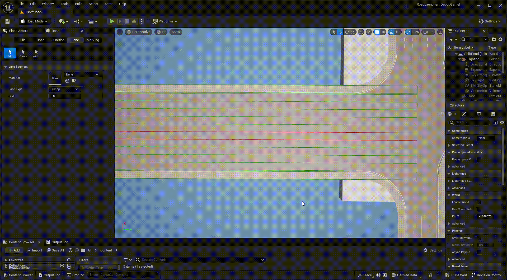

# Lane Edit
---

- Click **Lane** tab and **Edit** button to activate lane edit mode.

- **Left click** any road or junction to display all included lanes.

- **Left click** any lane to select it, you can change lane type and start distance of the lane segment.

{: .note }
Use the **Home/End** key to quickly select adjacent lanes and the **Tab** key to quickly select the next lane segment, which can be helpful when you want to select a collapsed or very thin lane.

- **Right click** the selected lane to split it into segments at click point.

- **Right click** on either side of the selected lane to duplicate it.

- Press **Delete** key to delete the selected lane segment.

