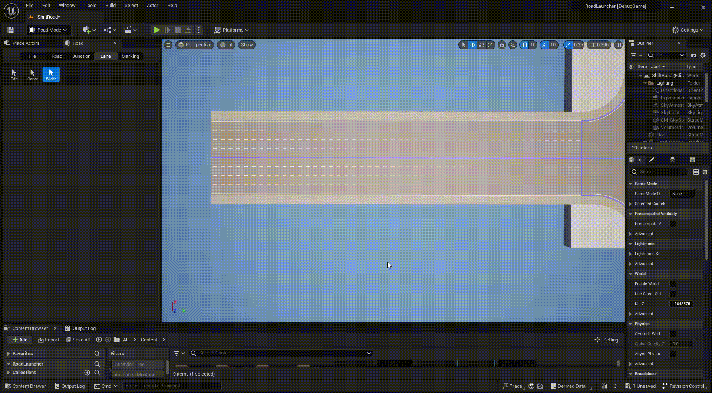
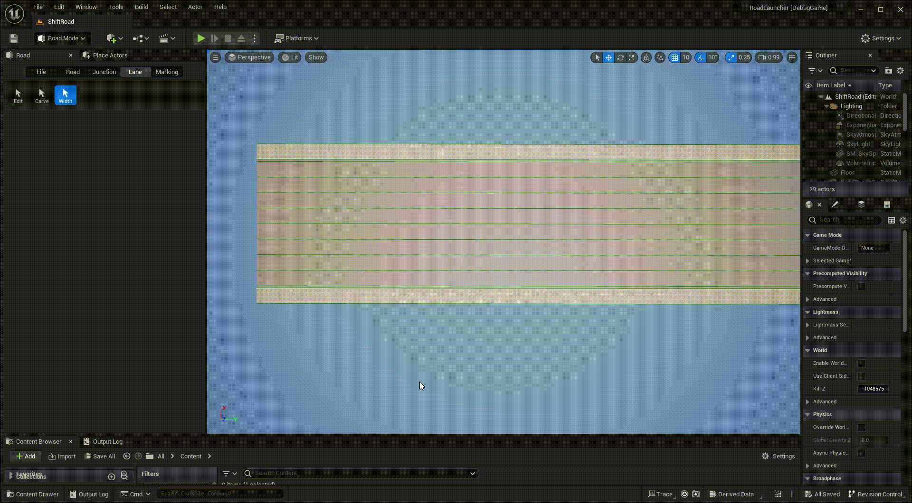

# Lane Width
Lane widths are generally defined by lane boundary offsets.

---

Click **Lane** tab and **Width** button to activate lane width mode.

- **Left click** any road or junction to display all included lane boundaries.

- **Left click** any boundary and its key point to select it, you can change offset and start distance of it.

- **Right click** any boundary to create a key point.

- Press **Delete** key to delete the selected key point.