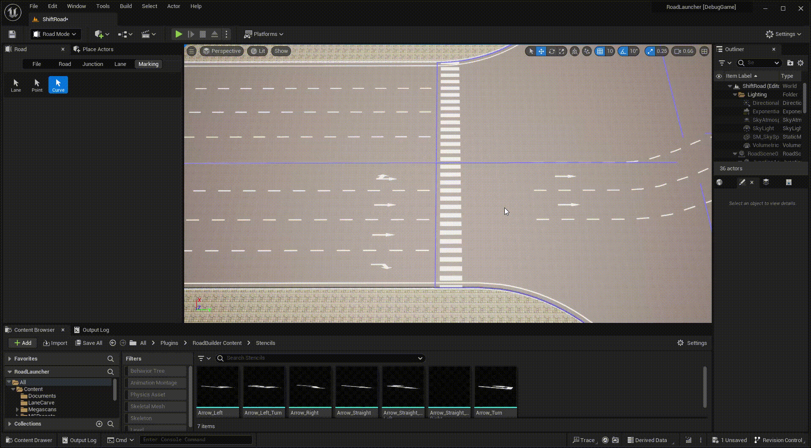
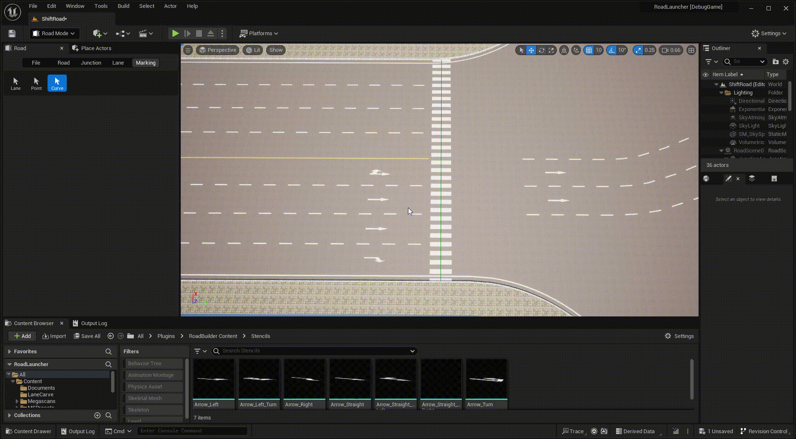

# Marking Curve
---

- Click **Marking** tab and **Curve** button to activate marking curve mode.

- **Left click** any road or junction to display all included curve markings.

- **Right click** on the road to create a curve marking.

- **Left click** any curve marking to select it, you can change marking style and the location of the curve marking.

- Press **Delete** key to delete the selected curve marking.