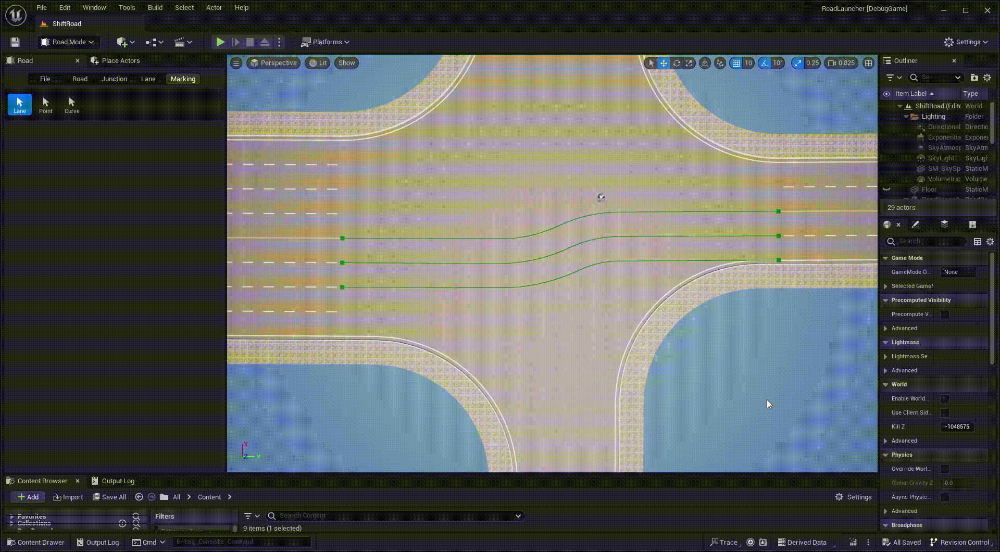

# Marking Lane
---

- Click **Marking** tab and **Lane** button to activate marking lane mode.

- **Left click** any road or junction to display all included lane boundaries.

- **Left click** any boundary to select it, you can change lane marking type and start distance of the boundary segment.

- **Right click** any boundary to split it into segments at click point.

- Press **Delete** key to delete the selected boundary.