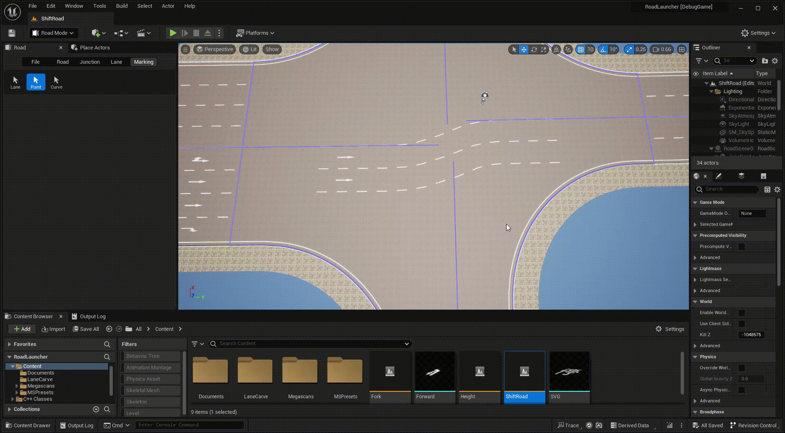
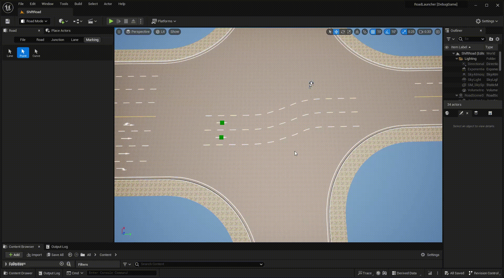
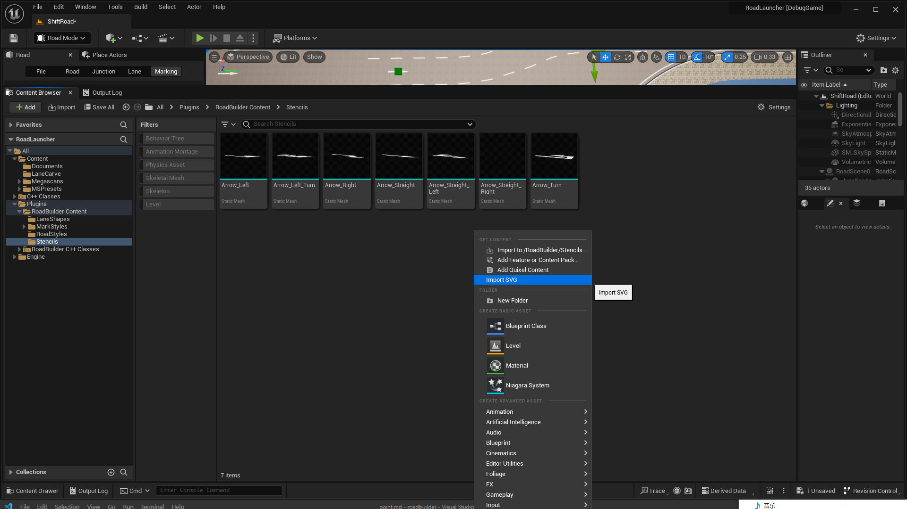
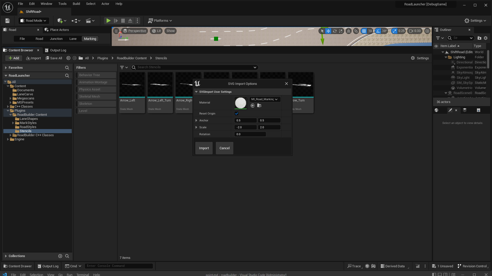

# Marking Point
---

- Click **Marking** tab and **Point** button to activate marking point mode.

- **Left click** any road or junction to display all included point markings.

- **Right click** on the road to create a point marking.

- **Left click** any point marking to select it, you can change marking mesh and the location of the point marking.

- Press **Delete** key to delete the selected point marking.

## Import SVG File

- Road markers such as arrows are usually stored in SVG format. This plugin can import SVG files into staticmesh for scene rendering.

- You can use negative scale value to flip the svg horizontally or vertically.
