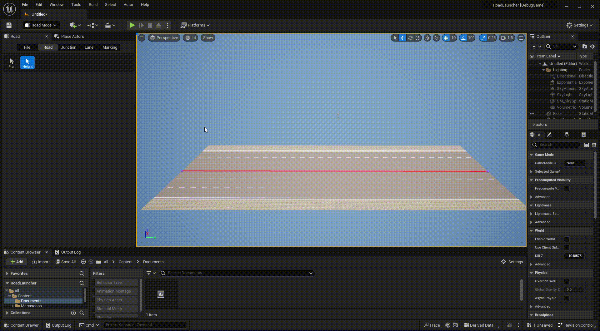
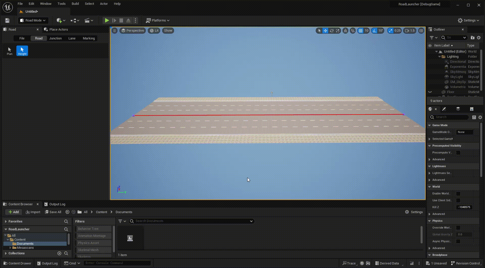
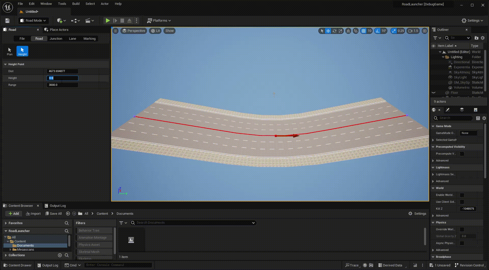

# Road Height
---

Click **Road** tab and **Height** button to activate road height mode.

## Height control point
 

Each road has 2 height control points by default, select and change the height value of them.
 
 

Right click the baseline of the road to add more control points.
 
 

Drag control point to move the height point.