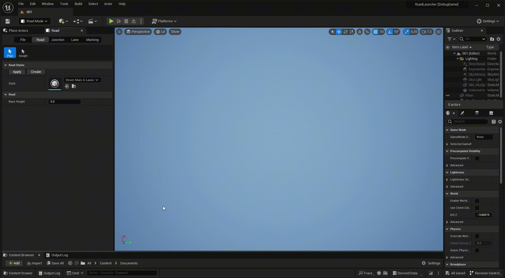
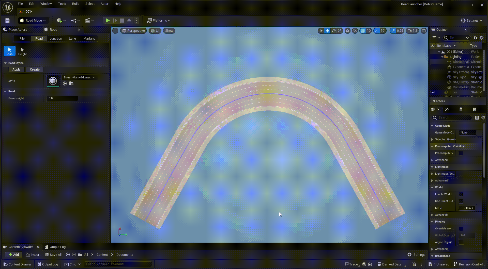
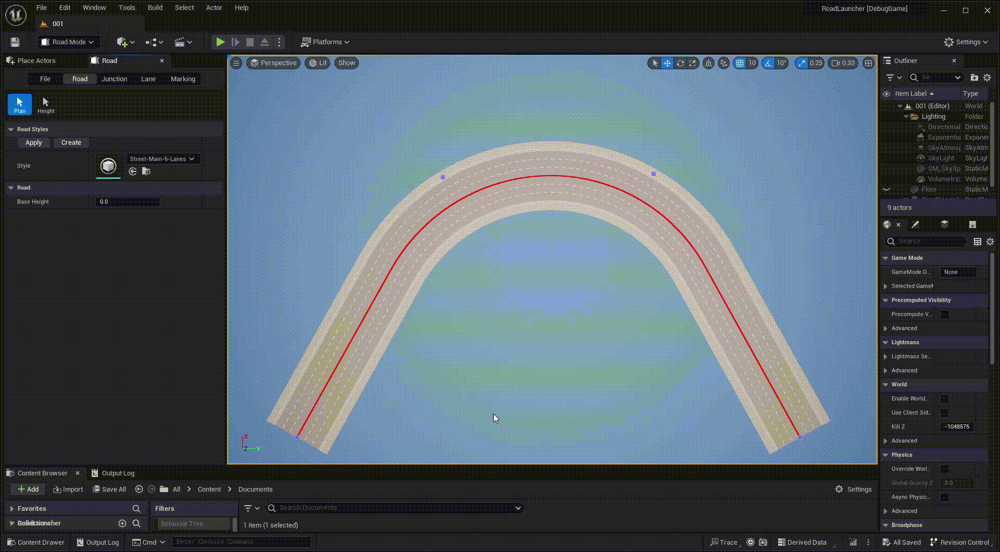
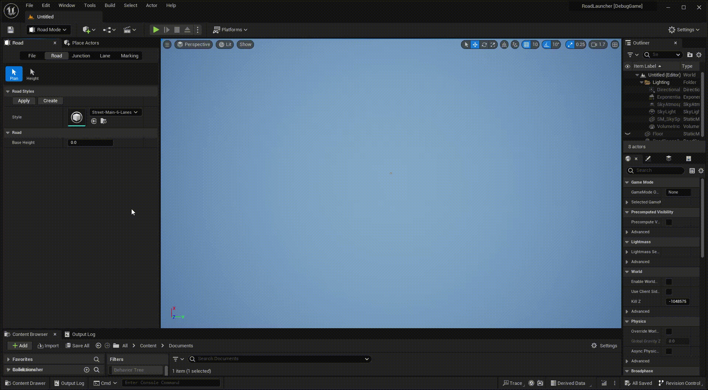
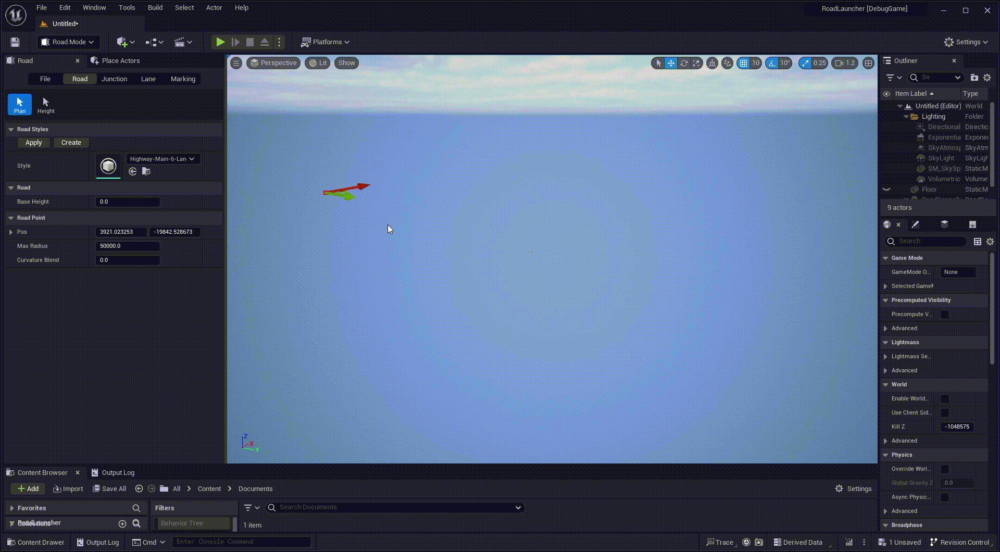

# Road Planning
---

Click **Road** tab and **Plan** button to activate road plan mode.

## Creating a simple road
 

Right click multiple times in the viewport to create a serial of control points.

## Dragging control point
 

Select a control point and drag it, or you can enter precise coordinates.

## Curvature
 

You can adjust the curvature of each control point, and control the curvature gradient via the CurvatureBlend parameter.

{: .note }
Variable curvature is generally used for the transition from straight roads to curved roads. CurvatureBlend parameter controls the ratio of variable curvature to fixed curvature, with 0 representing the entire section of road being fixed curvature, 1 representing the entire section of road being variable curvature, and 0.5 being half each.

## Road style
 

Choose appropriate road style before creating roads.
 
You can also create custom road styles by clicking the **Create** button.

## Base height
 

You can adjust base height of the road before creating it.